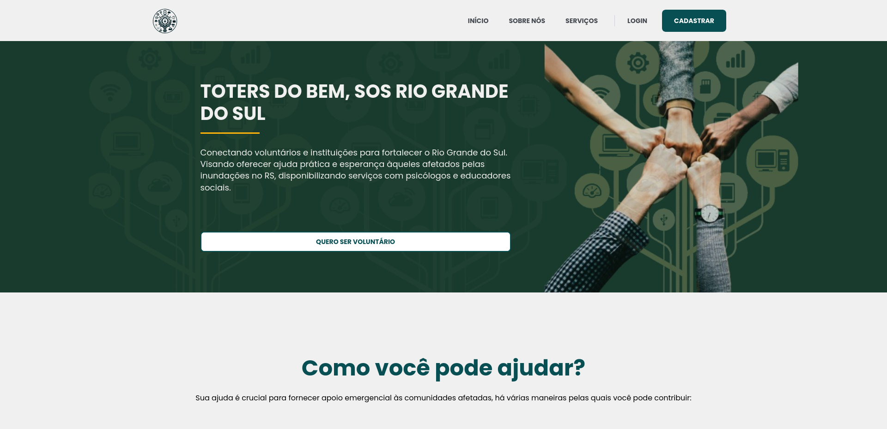
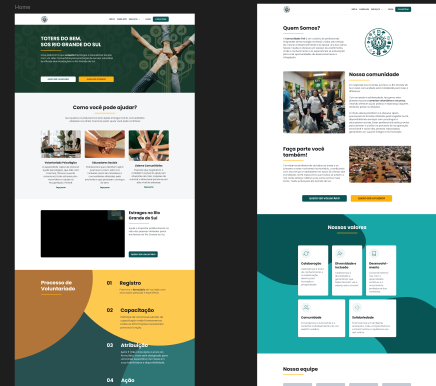

# Project Specification

## Project Overview

Toters do Bem is a collective of immigrant technology professionals in Brazil, united by a shared commitment to professional growth and mutual support. We connect volunteers and institutions to support recovery efforts in Rio Grande do Sul and Rio de Janeiro, providing practical aid and hope to those affected by floods. Our initiative facilitates services from psychologists, social educators, and volunteers.

## Software System

Our software system consists of three main components:

1. Database – Stores essential
2. Server – Handles application logic and data
3. Web Application – Provides a user-friendly interface for volunteers and other service providers.

### System Context

Our system is designed to store and connect psychologists, social educators, and volunteers with users who need support.

#### System Users

We have three distinct user profiles:

* Volunteers – Individuals who want to offer their time and support to help those
* Psychologists – Professionals providing mental health
* Educators – Social/community professionals offering educational guidance.

#### External Systems

Toters do Bem integrates: 

* Brazil States Codes 
* Brazil Professional Registration API

System Context Diagram

(Diagram placeholder)

### System Containers

* Web Application [Next.js] – The main landing page for general users and potential 
* Core API [TypeScript, Node.js] – The backend system managing data and business 
* Database [MongoDB] – Stores all essential data securely.

## Web Application

Our main web application consists of multiple component-based pages that adhere to our core design specifications.

### UI Designs

All UI/UX specifications and design assets are available in our [Figma](https://www.figma.com/design/pJuqzQQmzssQB14akNntsV/TOTERS) file.

### Functional Requirements

1. Authentication – Secure login and user
2. Browsing – Users can explore available services
3. Registration – Volunteers and professionals can sign up and offer their services.

