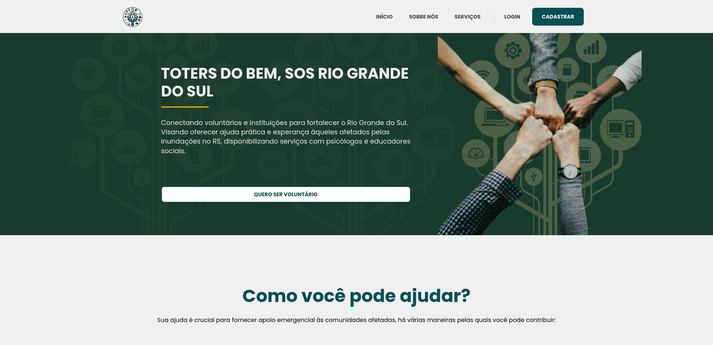
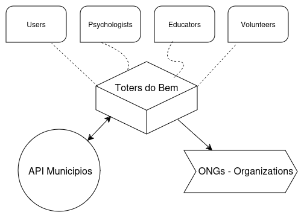
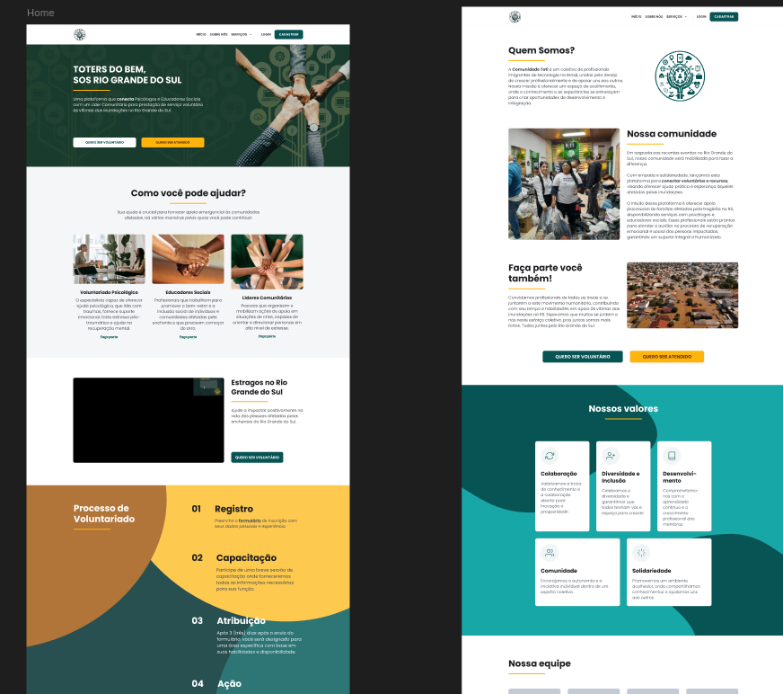

# Project Specification

## Project Overview

Toters do Bem is a collective of immigrant technology professionals in Brazil, united by a shared commitment to professional growth and mutual support. We connect volunteers and institutions to support recovery efforts in Rio Grande do Sul and Rio de Janeiro, providing practical aid and hope to those affected by floods. Our initiative facilitates services from psychologists, social educators, and volunteers.

## Software System

Our software system consists of three main components:

1. Web Application – Provides a user-friendly interface for volunteers and other service providers.
2. Server – Handles application logic and data
3. Database – Stores essential volunteers sensitive data

### System Context

Our system is designed to store and connect psychologists, social educators, and volunteers with users who need support.

#### System Users

We have four distinct user profiles:

* Users - Individuals who wants to know about our services
* Volunteers – Individuals who want to offer their time and support to help those
* Psychologists – Professionals providing mental health
* Educators – Social/community professionals offering educational services.

#### External Systems

The main external systems that Toters do Bem integrates are

* Brazil States Codes 
* ONGs and immigrants organizations

#### System Context Diagram

### System Containers

* Web Application [Next.js] – The main landing page for general users and potential 
* Core API [TypeScript, Node.js] – The backend system managing data and business 
* Database [MongoDB] – Stores all essential data securely.

#### Container Diagram

TO DO

## Toters do Bem Web Application

Our main web application consists of multiple component-based pages that adhere to our core design specifications.

### UI Designs

All UI/UX specifications and design assets are available in our [Figma](https://www.figma.com/design/pJuqzQQmzssQB14akNntsV/TOTERS) file.

### Functional Requirements

#### Authentication

* Volunteers can browse the app without beign authenticated
* Volunteers can create an account using email
* Volunteers can authenticate using their created account credentials
* Authenticated users can update their profile information
* Authenticated users can reset their password if needed

#### Browsing

* Volunteers can explore available services
* Volunteers can find relevant details about the project
* Volunteers can find important services offered

#### Registration

* Volunteers can sign up to offer their services
* Volunteers can choose availables volunteering options

### Architectural Requirements

Check out our [requirements](architectural-requirements.md).
